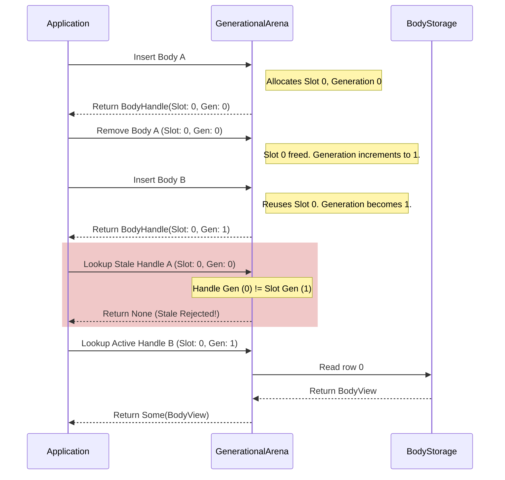

# Engine Architecture & Design

Iron Physics is built upon two core principles of modern systems programming: **high memory performance** and **absolute memory safety**. This page details the architectural design decisions that make Iron Physics fast, robust, and elegant.

---

## 1. Data-Oriented Design (DOD) via Struct-of-Arrays (SoA)

Traditional game engines typically model rigid bodies using standard Object-Oriented (OOD) practices, wrapping each body's properties in a single heap-allocated class or struct:

```rust
// ❌ Traditional Array-of-Structures (AoS) Layout
struct Body {
    position: Vec2,
    linear_velocity: Vec2,
    angle: f32,
    angular_velocity: Vec2,
    force: Vec2,
    torque: f32,
    inv_mass: f32,
    inv_inertia: f32,
    transform: Transform,
    aabb: Aabb,
    body_type: BodyType,
    gravity_scale: f32,
    // ... many other properties ...
}

let bodies: Vec<Body> = Vec::new();
```

While AoS is highly intuitive, it is incredibly inefficient for the CPU cache. During the physics integration step, the engine only needs to read and write a few variables (such as `position`, `linear_velocity`, `force`, and `inv_mass`). However, the CPU is forced to load the entire `Body` structure into cache lines, including unused fields like `aabb`, `user_data`, and `fixed_rotation`, resulting in heavy **cache pollution** and **cache misses**.

### The SoA Solution in Iron Physics

To solve this, Iron Physics employs a **Struct-of-Arrays (SoA)** layout inside the `BodyStorage` struct. Instead of an array of bodies, we store parallel contiguous arrays for individual fields:

```rust
//  Contiguous Struct-of-Arrays (SoA) Layout in Iron Physics
pub struct BodyStorage {
    pub position:          Vec<Vec2>,    
    pub linear_velocity:   Vec<Vec2>,    
    pub angle:             Vec<f32>,     
    pub angular_velocity:  Vec<f32>,     
    pub force:             Vec<Vec2>,    
    pub torque:            Vec<f32>,     
    pub inv_mass:          Vec<f32>,     
    pub inv_inertia:       Vec<f32>,    
    pub transform:         Vec<Transform>,  
    pub aabb:              Vec<Aabb>,        
    pub body_type:         Vec<BodyType>,
    // ...
}
```

This layout provides outstanding cache line density. When iterating through velocities and positions in the simulation loop, the CPU loads arrays directly into cache lines with zero overhead.

```
AoS Layout (Poor cache usage for step integration):
[ Pos1, Vel1, Mass1, AABB1, Type1 ][ Pos2, Vel2, Mass2, AABB2, Type2 ]
   ^     ^      ^                   ^     ^      ^
   L1 Cache reads everything, including unused AABB and Type data.

SoA Layout (High cache density in Iron Physics):
Positions:  [ Pos1 ][ Pos2 ][ Pos3 ][ Pos4 ][ Pos5 ]
Velocities: [ Vel1 ][ Vel2 ][ Vel3 ][ Vel4 ][ Vel5 ]
Inverses:   [ Mass1][ Mass2][ Mass3][ Mass4][ Mass5]
   ^     ^      ^
   L1 Cache loads only the exact streams needed. Vectorization is trivial.
```

---

## 2. Generational Arena Memory Safety

In a dynamic physics simulation, rigid bodies are created and destroyed frequently. If bodies are stored in a simple vector, removing a body in the middle shifts elements, invalidating existing indices. Alternatively, raw pointers lead to dangerous use-after-free and double-free vulnerabilities.

### The Packed Generational Handle

Iron Physics implements a type-safe **Generational Arena** (`GenerationalArena<T>`). When a body is added, it is assigned a `BodyHandle`, which is an opaque wrapper containing a 64-bit integer:

```rust
pub struct BodyHandle(u64);
```

Within this 64-bit value, we pack two 32-bit components:
*   **Slot Index (`u32`)**: The specific row index in the `BodyStorage` contiguous vectors.
*   **Generation (`u32`)**: An incrementing counter that tracks how many times this slot has been recycled.

```
 64-bit BodyHandle layout:
+-----------------------------------+-----------------------------------+
|      Generation Counter (32 bits) |          Slot Index (32 bits)     |
+-----------------------------------+-----------------------------------+
 63                               32 31                                0
```

### Stale Reference Rejection

When a body is removed, its slot index is placed on a `free_list` stack so it can be reused later, and the slot's **generation counter is incremented**.

If the application attempts to access a body using a stale handle, the arena detects that the handle's generation does not match the slot's current generation and safely returns `None`.



---

## 3. Simulation Step Integration

The core simulation loop runs inside `World::step(dt)`. It uses a **Semi-Implicit Euler** integration method (also known as symplectic Euler). This scheme is widely used in real-time game physics because it is simple, fast, and exhibits excellent energy conservation characteristics compared to Explicit Euler.

For each active, awake, and non-static rigid body, the step proceeds as follows:

### Step 1: Force Accumulation
Apply gravity and external forces to calculate the total force $\vec{F}$ and torque $\tau$:
$$\vec{F}_{\text{total}} = \vec{F}_{\text{accumulated}} + \vec{g} \cdot s_{\text{gravity}} \cdot m$$
Where:
*   $\vec{g}$ is the gravity vector.
*   $s_{\text{gravity}}$ is the gravity scale of the body.
*   $m$ is the mass ($m = 1.0 / \text{inv\_mass}$).

### Step 2: Velocity Integration
First, integrate the linear velocity $\vec{v}$ and angular velocity $\omega$ using the accumulated forces and torques:
$$\vec{a} = \vec{F}_{\text{total}} \cdot m_{\text{inv}}$$
$$\alpha = \tau \cdot I_{\text{inv}}$$
$$\vec{v}_{\text{next}} = \vec{v} + \vec{a} \cdot \Delta t$$
$$\omega_{\text{next}} = \omega + \alpha \cdot \Delta t$$
Where:
*   $\vec{a}$ and $\alpha$ are linear and angular accelerations.
*   $m_{\text{inv}}$ and $I_{\text{inv}}$ are the inverse mass and inverse inertia.
*   $\Delta t$ is the simulation time step (`dt`).

### Step 3: Damping
Apply linear and angular dampings to simulate medium resistance (like air resistance):
$$\vec{v}_{\text{damped}} = \vec{v}_{\text{next}} \cdot \max\left(0, 1 - d_{\text{linear}} \cdot \Delta t\right)$$
$$\omega_{\text{damped}} = \omega_{\text{next}} \cdot \max\left(0, 1 - d_{\text{angular}} \cdot \Delta t\right)$$
Where:
*   $d_{\text{linear}}$ and $d_{\text{angular}}$ are the damping coefficients.

### Step 4: Position & Angle Integration
Integrate positions using the **newly computed velocities** (the defining characteristic of the Semi-Implicit Euler method):
$$\vec{x}_{\text{next}} = \vec{x} + \vec{v}_{\text{damped}} \cdot \Delta t$$
$$\theta_{\text{next}} = \theta + \omega_{\text{damped}} \cdot \Delta t$$

### Step 5: Post-Step Cleanup & Cache Sync
After updating coordinates:
1.  **Clear Forces**: Accumulated force and torque buffers are reset to zero ($\vec{F}_{\text{accumulated}} \gets \vec{0}$, $\tau \gets 0.0$).
2.  **Sync Transforms**: Recompute the global coordinate cached `Transform` structure for each body:
    $$T = \text{Transform} \{ \text{position}: \vec{x}_{\text{next}}, \text{rotation}: \theta_{\text{next}} \}$$
    This caches the rotation sine/cosine matrices to make subsequent collision checks and rendering retrievals extremely fast.
