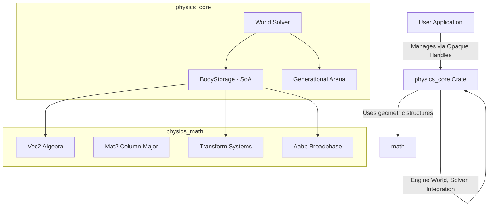

# Iron Physics

Welcome to **Iron Physics**, an ultra-lightweight, high-performance, and memory-safe 2D rigid-body physics engine built in Rust. 

Iron Physics is designed with a **Data-Oriented Design (DOD)** philosophy, leveraging a cache-friendly Struct-of-Arrays (SoA) layout and a type-safe **Generational Arena** indexer. This combination ensures maximum execution speed and robust memory safety, making it a professional-grade simulation foundation for games, interactive apps, and physics experiments.

---

## Key Features

*   ⚡ **Data-Oriented Architecture (SoA)**: Unlike standard Object-Oriented layouts, bodies are stored in parallel contiguous arrays. This enables high-speed linear velocity/position integration with minimal CPU cache misses.
*   🛡️ **Generational Arena Indexing**: Rigid bodies are identified by lightweight, packed `u64` generational handles (`BodyHandle`). This completely eliminates dangling pointers, stale index references, and use-after-free bugs.
*   📦 **Modular Workspace Architecture**: The engine is split into two cleanly separated Crates:
    *   `physics_math`: A self-contained, high-performance 2D math library (Vectors, Column-Major Matrices, Transforms, and AABBs).
    *   `physics_core`: The core physics coordinator, generational collections, and solver algorithms.
*   ⚙️ **Highly Configurable Solver**: Fine-tune simulation behaviors using custom solver iterations, damping parameters, sleeping thresholds, and warm-starting multipliers.

---

## Architectural Layout

The diagram below shows how the components of Iron Physics interact. The application interacts with `physics_core` via opaque handles, while `physics_core` relies on `physics_math` for raw geometric operations.



---

## Quick Start Example

Getting started with Iron Physics is straightforward. Below is a complete example of creating a physics world, adding a dynamic falling body, and stepping the simulation:

```rust
use ironphysics::{World, WorldConfig, Vec2, Transform, Aabb};
use ironphysics::body::{BodyDesc, BodyType};

fn main() {
    // 1. Initialize the physics world with default configurations
    let config = WorldConfig::default();
    let mut world = World::new(config);
    
    // Set custom gravity (e.g., standard Earth gravity)
    world.gravity = Vec2::new(0.0, -9.81);

    // 2. Define and add a dynamic rigid body
    let body_desc = BodyDesc {
        body_type: BodyType::Dynamic,
        position: Vec2::new(0.0, 10.0), // Start 10 meters up
        linear_velocity: Vec2::zero(),
        angle: 0.0,
        angular_velocity: 0.0,
        force: Vec2::zero(),
        torque: 0.0,
        inv_mass: 1.0,      // 1.0 kg mass
        inv_inertia: 1.0,   // 1.0 kg*m^2 inertia
        transform: Transform::default(),
        aabb: Aabb::default(),
        gravity_scale: 1.0, // Responds fully to gravity
        linear_damping: 0.1, // Smooth linear deceleration
        angular_damping: 0.1,
        is_awake: true,
        fixed_rotation: false,
        user_data: None,
    };
    
    let body_handle = world.add_body(body_desc);

    // 3. Step the simulation (60 Hz game loop step)
    let dt = 1.0 / 60.0;
    
    for step in 1..=10 {
        world.step(dt);
        
        // Retrieve the body properties using its safe handle
        if let Some(body) = world.body(body_handle) {
            println!(
                "Step {}: Position = ({:.2}, {:.2}), Velocity = ({:.2}, {:.2})",
                step,
                body.position.x,
                body.position.y,
                body.linear_velocity.x,
                body.linear_velocity.y
            );
        }
    }
}
```

---

## Next Steps

To dive deeper into the technical mechanics, explore:

1.  [**Architecture & Design**](architecture.md): Explore Data-Oriented Design and Generational Arenas.
2.  [**Math Module**](math.md): Learn about Vector and Matrix operations.
3.  [**Core Module**](core.md): Understand solver stepping and body storage.
4.  [**Usage Guide**](usage.md): Practical guides and advanced physics applications.
